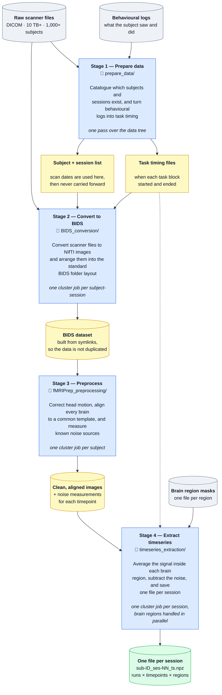

# fMRI HPC Pipeline

A four-stage pipeline that takes raw scanner DICOM output to denoised,
ROI-averaged BOLD timeseries ready for downstream modelling. Built to run on a
Linux HPC cluster under SLURM.

Operational scale: **10 TB+ of imaging data across 1,000+ subjects**, with
multiple sessions and two task runs per session. Parallelism is SLURM job
arrays across subjects, plus `joblib` across ROIs within a subject.

Written for my own and my lab's research use — not a general-purpose package.
It targets a specific acquisition protocol, and adapting it to another one means
editing config and a small amount of code. See
[Status and known limitations](#status-and-known-limitations).

> **Note for reviewers:** this pipeline cannot be run without the source imaging
> data, which is human-subjects data under a data-use agreement, and without an
> HPC allocation. To make the design legible anyway:
> [**a single subject's walkthrough**](docs/walkthrough.md) traces one subject
> through all four stages, [`examples/output_format.md`](examples/output_format.md)
> documents the output contract, and
> [`examples/make_synthetic_output.py`](examples/make_synthetic_output.py)
> generates a structurally identical output file from noise so the format can be
> inspected with nothing but NumPy.

## Pipeline



## The four stages

**1. `prepare_data/` — subject lists and task design.**
Walks the raw DICOM tree to build the subject roster, and maps each subject's
scan dates onto sequential session numbers. The scan date is used here and then
dropped; everything downstream refers to `ses-01`, so a re-identifying calendar
date never reaches a filename. In MATLAB, raw E-Prime logs are parsed into trial
tables and then into BIDS `_events.tsv` and SPM design files, with onsets shifted
by `−TR/2` to match fMRIPrep's slice-timing reference.

**2. `BIDS_conversion/` — DICOM to BIDS.**
A SLURM array converts each subject-session with `dcm2niix`, one task per
session. A second pass lays the results out as a BIDS dataset using **symlinks
rather than copies** — at 10 TB+ this avoids a second full copy of the dataset.
Scanner-filename-to-BIDS-entity mapping is declared in
[`bids_mapping.json`](BIDS_conversion/nii2bids/bids_mapping.json), not hardcoded.
JSON sidecars are copied instead of linked, because they are mutated: `TaskName`
is injected, and fieldmap `IntendedFor` lists are built only from functional
files that actually exist.

**3. `fMRIPrep_preprocessing/` — preprocessing.**
A SLURM array runs a pinned fMRIPrep container under Singularity, one task per
subject, outputting to `MNI152NLin2009cAsym:res-2`. FreeSurfer surface
reconstruction is skipped (`--fs-no-reconall`), which is the largest single time
saving, since stage 4 needs only volumetric ROIs. `fmriprep_singleSubj.sh` runs
one subject for debugging before committing an array.

**4. `timeseries_extraction/` — denoised ROI timeseries.**
Subjects are included only if they both completed preprocessing and have complete
behavioral data. A SLURM array covers subject-sessions while `joblib` fans out
across ROIs within each task; BLAS threading is pinned to 1 so workers don't
oversubscribe the allocated cores. Per ROI: mask, drop dummy scans from signal
and confounds together, high-pass filter, regress out 6 motion parameters plus
CSF and white matter, standardise, and average across voxels.
Output is one `.npz` per subject-session —
see [`examples/output_format.md`](examples/output_format.md).

## Requirements

| | |
|---|---|
| Cluster | Linux with SLURM; Singularity/Apptainer for stage 3 |
| Python | 3.13 — see [`requirements.txt`](requirements.txt) |
| MATLAB | R2019b or newer (stage 1 behavioral parsing only) |
| Binaries | `dcm2niix`, `jq` |
| Containers | fMRIPrep 24.1.1 (`.simg`) |
| Validation | `bids-validator` 1.15.0 |
| Licence | A FreeSurfer licence file, obtained separately. **Never commit it.** |

## Configuration

All paths, cluster settings, and acquisition parameters live in one file. No
script contains a hardcoded path.

```bash
cp config/pipeline.env.example config/pipeline.env
$EDITOR config/pipeline.env
```

`config/pipeline.env` is gitignored; only the `.example` is tracked. Bash stages
source it via `config/load_config.sh`, and MATLAB stages read the same file
through `config/pipeline_config.m`, so the two can't drift apart. A missing or
incomplete config fails loudly rather than silently writing into the repo.

## Running it

Each stage is run in order. The submit scripts call `sbatch` internally, so they
are launched with `bash`, not `sbatch`.

```bash
# Stage 1 — subject roster and session map, then task design in MATLAB
bash prepare_data/make_subjlist/gen_subjlist.sh
bash prepare_data/make_subjlist/gen_session_map.sh
matlab -batch "run('prepare_data/make_behav_design/task_design.m')"
matlab -batch "run('prepare_data/make_behav_design/task_design_bids.m')"

# Stage 2 — DICOM → NIfTI (array job), then BIDS layout
bash BIDS_conversion/dcm2nii/submit_dcm2nii_job.sh
bash BIDS_conversion/nii2bids/nii2bids_all.sh
bash BIDS_conversion/nii2bids/behav2bids_all.sh
bids-validator "$BIDS_DIR"

# Stage 3 — fMRIPrep (array job, one task per subject)
bash fMRIPrep_preprocessing/fmriprep_multiSubj.sh

# Stage 4 — ROI timeseries (array job × joblib over ROIs)
python timeseries_extraction/gen_subjlist_for_ts.py
bash timeseries_extraction/submit_ts_extraction_job.slurm
python timeseries_extraction/check_ts.py "$TS_DIR/sub-<ID>_ses-<NN>_ts.npz"
```

Between stages 2 and 3, finish the BIDS dataset root as described in
[`bids_finish_instruction.txt`](BIDS_conversion/nii2bids/bids_finish_instruction.txt)
(`dataset_description.json`, `.bidsignore`, `README`).

## Failure handling

At this scale individual tasks fail routinely, and the design assumes it. Every
stage writes one log per unit of work, so a failure at subject 700 of 1,000 is
diagnosable without re-running anything.

- `extract_timed_out.sh` greps stage-2 logs for `DUE TO TIME LIMIT` and re-emits
  the affected subject-sessions as a session map for resubmission with a longer
  walltime.
- Sessions with no task data are skipped rather than written as empty BIDS
  folders that would later fail validation.
- `run_extraction.py` verifies the preprocessed BOLD, confounds, and events files
  all exist before touching a run, and extracts each ROI in a `try/except` so one
  bad mask doesn't lose the subject.

## Status and known limitations

Actively used, and honest about what it is: a set of stage scripts, not a
packaged tool. Known gaps, in rough priority order:

- **ROI masks are affine-resampled, not nonlinearly warped.**
  `resample_roi()` in `run_extraction.py` only moves the mask onto the functional
  voxel grid. This is correct *only* for ROIs already defined in
  `MNI152NLin2009cAsym`. An atlas in any other space must first be warped with
  ANTs (`antsApplyTransforms`, using fMRIPrep's
  `*_from-MNI152NLin2009cAsym_to-T1w_mode-image_xfm.h5`). Resampling alone
  produces misaligned ROIs and invalid timeseries **without raising an error**.
  This is the most important caveat in the repo.
- **Acquisition-specific.** Two runs with `AP`/`PA` phase encoding are hardcoded
  in `run_extraction.py` (`run_dir_pairs`), and the fieldmap `IntendedFor`
  template in `bids_mapping.json` is written for a two-run task. A different
  protocol needs both edited.
- **Confound set is fixed.** Six motion parameters plus CSF and white matter — no
  aCompCor, no scrubbing, no motion-outlier censoring.
- **No automated tests.** Correctness is checked by inspection with `check_ts.py`
  across a batch.
- **MATLAB dependency** in stage 1, for parsing E-Prime logs.
- `run_extraction.py` imports `nilearn.input_data`, which is deprecated in favour
  of `nilearn.maskers` and will be removed in a future nilearn release.

## Privacy

This pipeline processes human-subjects medical imaging. The repo contains **no
data of any kind** — no subject identifiers, scan dates, derived timeseries, or
QC figures.

Structurally: every stage writes outputs to `$WORK_DIR` from the config, never
into the repo; scan dates are consumed in stage 1 and never propagate into
filenames; and `.gitignore` covers subject manifests, session maps, `.npz`,
`.nii.gz`, `_events.tsv`, `sub-*/` trees, and the FreeSurfer licence.

## Authors

Linjing Jiang — [@linjjiang](https://github.com/linjjiang)

## License

MIT — see [LICENSE](LICENSE).

## Acknowledgments

* [dcm2niix](https://github.com/rordenlab/dcm2niix)
* [bids-validator](https://pypi.org/project/bids-validator/)
* [fMRIPrep](https://fmriprep.org/en/stable/index.html)
* [Nilearn](https://nilearn.github.io/)
* Stage 1 behavioral parsing is based on a script by Zhiyao Gao.
